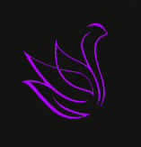
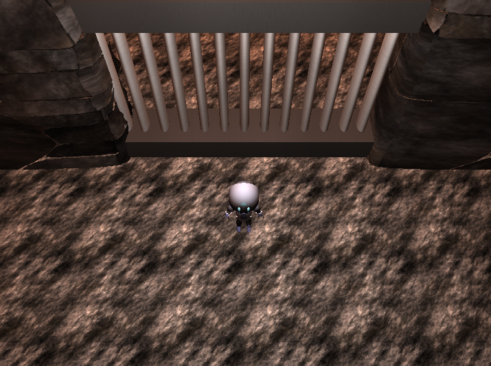
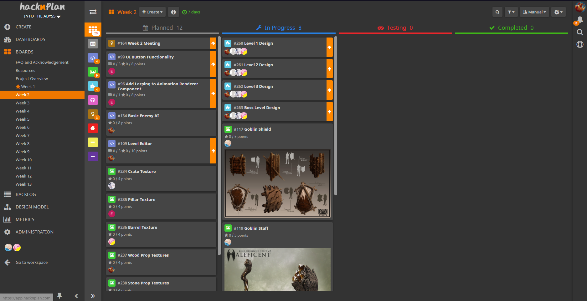
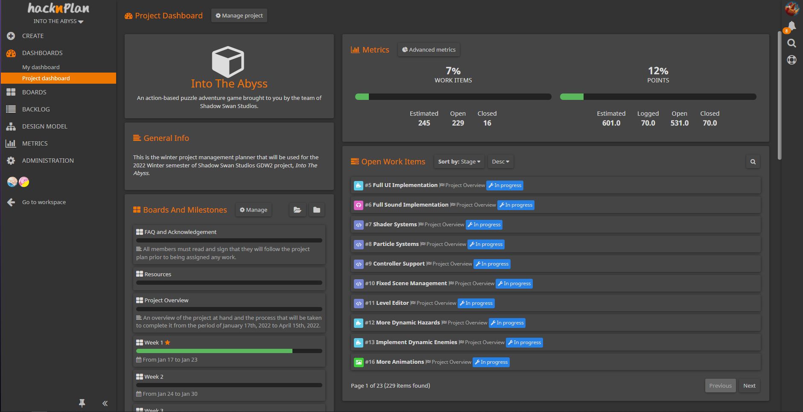
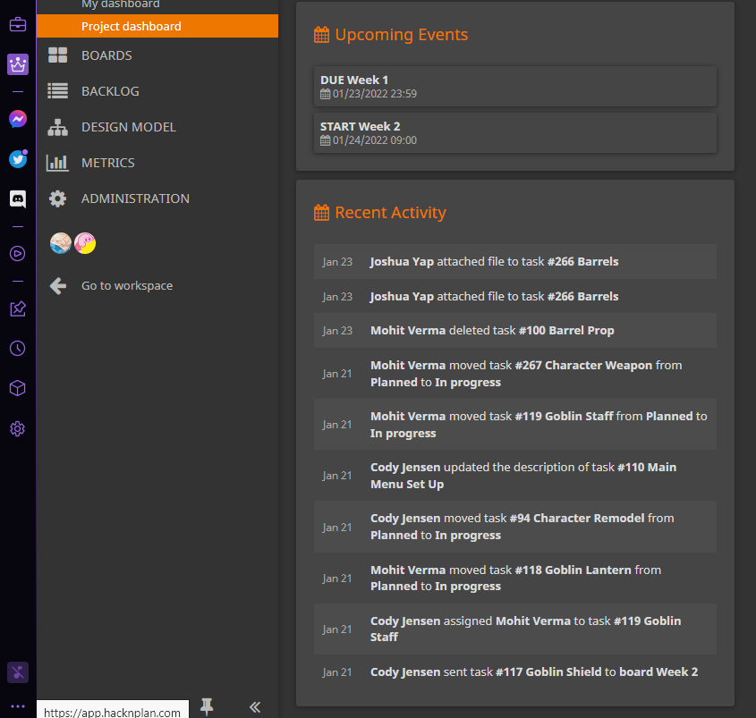
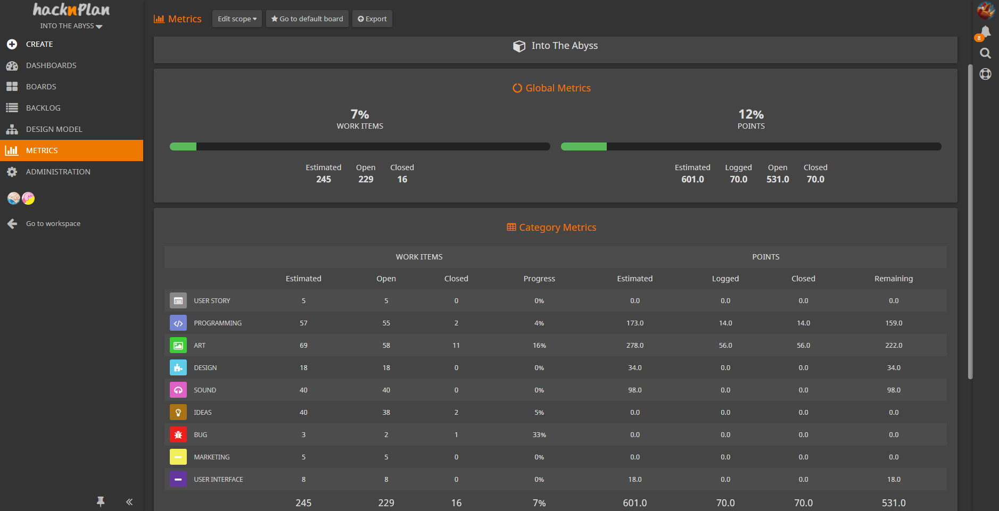

<!-- ABOUT THE PROJECT -->
## About The Project

<!-- PROJECT LOGO -->
 

  

  <h3 align="center">Into The Abyss</h3>

  

    Are you ready to uncover the the secrets of the Abyss?
  

  

<!-- SUMMARY -->
## Summary

Into the Abyss is a single player puzzle-platforming dungeon crawler experience where the player must navigate through a labyrinth of dangerous traps and enemies to uncover the secrets of the Abyss.  As the player goes deeper into the Abyss, strange things begin to happen.  The world begins to distort, and your shadow comes to life.  As your own shadow guides you deeper into the Abyss, will you be able to maintain your composure? 

<a href="https://www.youtube.com/watch?v=zVMPAGrwtZk"> Elevator Pitch Video </a>

(<a href="#top">back to top</a>)

<!-- ROADMAP -->
## Roadmap

- [X] Gameplay Loop
- [X] Rendering Systems
- [X] Input Controller
- [X] Scene Management
- [ ] Level Design
- [ ] Level Editor
- [ ] UI Integration
- [ ] Sound Integration
- [ ] Shaders
- [ ] Particle Systems
- [ ] More Animations
- [ ] More Models
- [ ] More Dynamic Hazards
- [ ] Artificial Intelligence
- [ ] Controller Support

(<a href="#top">back to top</a>)

<!-- KANBAN -->
## Project Management

For project management, we will be coordinating our tasks and accomplishments through the use of a Hack and Plan Kanban board.  Multiple boards have been created to provide an overview of all remaining tasks in the project to meet our minimum viable product, as well as to provide weekly sprints towards completing our tasks in a timely manner.  All tasks are prepared in advance and updated as needed in the Planned column of our Kanban chart.  At the start of each weekly sprint, we assign the tasks to each member of the team and move it to the In Progress column.  Upon completion of work, the task will be moved to the Testing column indicating it is pending review.  Following a review and successful integration into the project, the tasks is marked Completed.

 

Hack and Plan allows us to track all activities performed on a daily basis, allowing us to quickly identify any task management issues and resolve them immediately before any larger problems arise.  It also provides variable metrics to identify work performance and task progression in order to ensure we maintain a solid work flow.  

 

  

 

  

 

  

 

  

(<a href="#top">back to top</a>)

